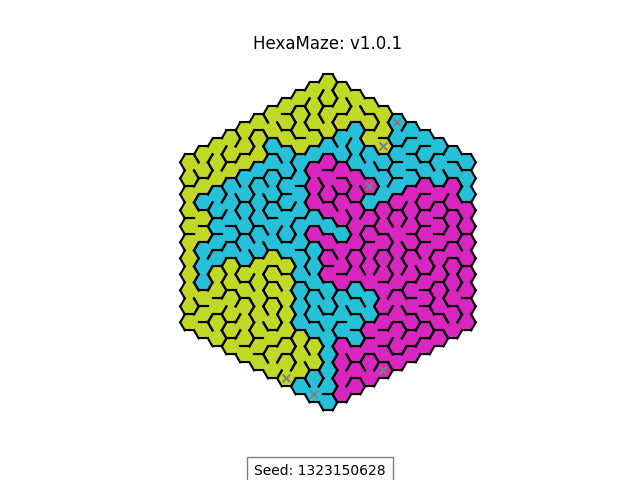

# Intertwined Mazes Generator

This application generates intertwined mazes on a hexagonal grid. You can customize the size of the grid, the number of mazes, and other parameters.

## Installation from Packages

TODO

## Installation from Source

Clone the repository to your local machine:

```bash
git clone https://github.com/yourusername/maze-generator.git
cd maze-generator
```
Ensure you have Python installed, and then install the required packages:
```
pip install -r requirements.txt
```

Usage
Run the script with Python. Here are some command-line options you can use:

```
--size: Specify the size of the hexagonal grid (default is 10).
--num_mazes: Specify the number of intertwined mazes to generate (default is 3).
--seed: Provide a seed for the random number generator to reproduce specific mazes.
--debug: Adds debug output to the generated maze image.
--output: Specify the filename to save the generated maze image.
```

If --output is not set, it will open the immage inside a new window.

Examples
Generate a basic maze:

```bash
python ./hexamaze/mazing.py
```
Generate a maze with specific options and save the output:

Example Maze



Example Maze with Debug


Contributing
Contributions are welcome! Please fork the repository and submit a pull request with your improvements.

License
This project is licensed under the MIT License - see the LICENSE file for details.


This markdown file provides a comprehensive guide for users to understand how to install, use, and contribute to the maze generator project. It also includes placeholders for screenshots to visually demonstrate the output of the application.
